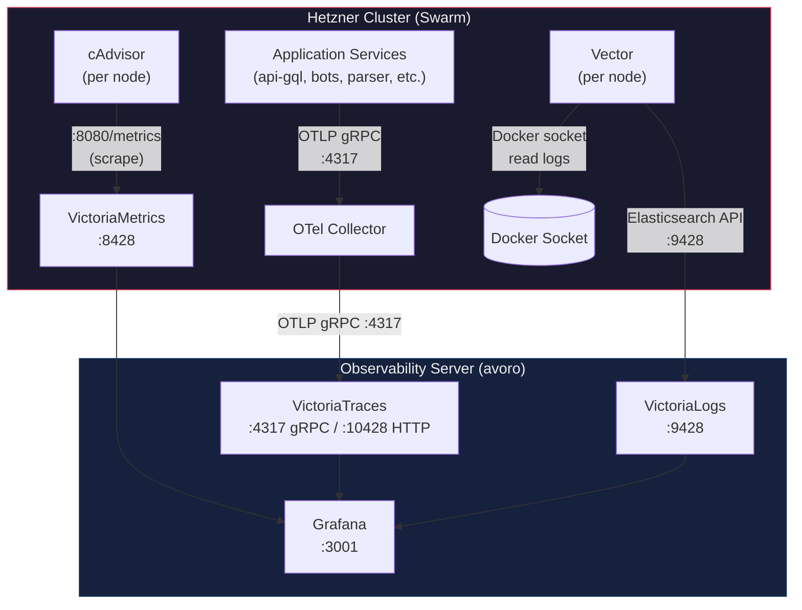
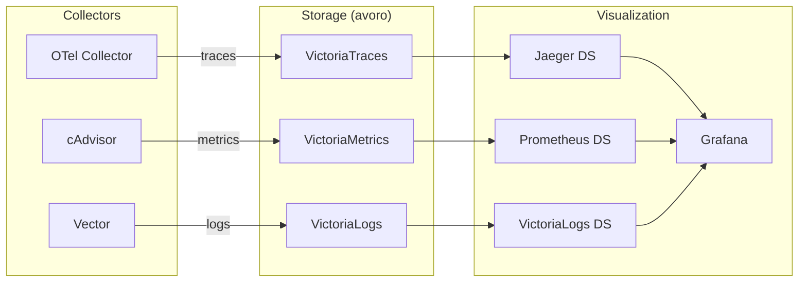

# Observability Stack

Full observability stack based on the VictoriaMetrics ecosystem. Provides distributed tracing, container metrics, and log aggregation with a single Grafana UI.

## Architecture



## Data Flow



## Components

### Storage Layer (Observability Server)

| Component | Image | Port | Purpose |
|-----------|-------|------|---------|
| VictoriaTraces | `victoriametrics/victoria-traces:latest` | 4317, 10428 | Distributed trace storage |
| VictoriaMetrics | `victoriametrics/victoria-metrics:latest` | 8428 | Time-series metrics storage |
| VictoriaLogs | `victoriametrics/victoria-logs:latest` | 9428 | Log storage and querying |
| Grafana | `grafana/grafana:latest` | 3001 | Visualization UI |

### Collection Layer (Hetzner Cluster)

| Component | Image | Purpose |
|-----------|-------|---------|
| OTel Collector | `otel/opentelemetry-collector-contrib` | Collects traces from application services |
| cAdvisor | `gcr.io/cadvisor/cadvisor` | Collects container metrics (CPU, RAM, network, disk I/O) |
| Vector | `timberio/vector` | Collects Docker container logs |

## Deployment

### 1. Observability Server (avoro)

Copy files to the server:

```bash
ssh avoro
mkdir -p /root/satont/infra/observability
cd /root/satont/infra/observability
```

Required files:
- `docker-compose.observability.yml`
- `configs/grafana/provisioning/datasources/` (3 files)

Start:

```bash
docker compose -f docker-compose.observability.yml up -d
```

### 2. Hetzner Cluster

#### Update OTel Collector config

Edit `configs/otel/otel-collector.yaml` — replace `OBSERVABILITY_SERVER_IP` with actual server IP.

#### Vector config

Edit `configs/vector/vector.yaml` — replace `OBSERVABILITY_SERVER_IP` with actual server IP.

#### Deploy

```bash
docker stack deploy -c docker-compose.stack.yml twir
```

## Configuration

### Application Environment Variables

```env
OTEL_ENDPOINT=OBSERVABILITY_SERVER_IP:4317
OTEL_INSECURE=true
OTEL_TRACING_ENABLED=true
OTEL_METRICS_ENABLED=false
```

### Vector Config (`configs/vector/vector.yaml`)

```yaml
sources:
  docker:
    type: docker_logs
    include_labels:
      - com.docker.stack.namespace
      - com.docker.service.name

transforms:
  enrich:
    type: remap
    inputs: [docker]
    source: |
      .stack = .label."com.docker.stack.namespace" ?? "unknown"
      .service = .label."com.docker.service.name" ?? .container_name ?? "unknown"

sinks:
  victoria_logs:
    type: elasticsearch
    inputs: [enrich]
    endpoints: ["http://OBSERVABILITY_SERVER_IP:9428/insert/elasticsearch/"]
    api_version: v8
    compression: gzip
    healthcheck:
      enabled: false
    query:
      _msg_field: message
      _time_field: timestamp
      _stream_fields: "host,stack,service,container_name"
```

### Grafana Datasources

Auto-provisioned via `configs/grafana/provisioning/datasources/`:

| Datasource | Type | URL |
|------------|------|-----|
| VictoriaTraces | Jaeger | `http://victoria-traces:10428` |
| VictoriaMetrics | Prometheus | `http://victoria-metrics:8428` |
| VictoriaLogs | VictoriaLogs plugin | `http://victoria-logs:9428` |

## Usage

### Viewing Traces

1. Open Grafana → Explore → Select **VictoriaTraces** datasource
2. Search by service name, operation, duration
3. Click a trace to see the flame graph and span details

### Viewing Container Metrics

1. Open Grafana → Explore → Select **VictoriaMetrics** datasource
2. Use PromQL to query container metrics:

```promql
# CPU usage per container
rate(container_cpu_usage_seconds_total{container_label_com_docker_stack_namespace="twir"}[5m])

# Memory usage per container
container_memory_usage_bytes{container_label_com_docker_stack_namespace="twir"}

# Network RX bytes per service
rate(container_network_receive_bytes_total{container_label_com_docker_stack_namespace="twir"}[5m])
```

3. Filter by stack/service using Docker labels:
   - `container_label_com_docker_stack_namespace` — stack name (e.g., "twir")
   - `container_label_com_docker_service_name` — service name (e.g., "api-gql", "bots")

### Viewing Logs

1. Open Grafana → Explore → Select **VictoriaLogs** datasource
2. Use LogsQL to query:

```logql
# All logs from a specific service
{stack="twir", service="api-gql"}

# Error logs across all services
{stack="twir"} level:error

# Search for specific text
{stack="twir"} "timeout"

# Logs from the last 5 minutes with JSON parsing
{stack="twir"} | json | level = "error"
```

3. **Live streaming**: Click the "Live" button in Explore to see logs in real-time

### Filtering by Stack/Service

In Grafana dashboards, create variables for interactive filtering:

1. **Variable `stack`**: Query `container_label_com_docker_stack_namespace` from VictoriaMetrics
2. **Variable `service`**: Query `container_label_com_docker_service_name` filtered by `$stack`
3. Use `$stack` and `$service` in panel queries

## Grafana Access

- **URL**: `http://<server>:3001`
- **Default login**: `admin` / `admin`
- Change password on first login

## Resource Requirements

### Observability Server

| Component | RAM | CPU | Disk |
|-----------|-----|-----|------|
| VictoriaTraces | ~256MB | 0.5 | 50GB max |
| VictoriaMetrics | ~256MB | 0.5 | ~2GB/90d |
| VictoriaLogs | ~256MB | 0.5 | 25GB max |
| Grafana | ~128MB | 0.25 | ~500MB |
| **Total** | **~900MB** | **~1.75** | **~77.5GB max** |

### Hetzner Cluster (per node)

| Component | RAM | CPU |
|-----------|-----|-----|
| cAdvisor | ~64MB | 0.1 |
| Vector | ~32MB | 0.05 |

## Troubleshooting

### Traces not appearing

1. Check OTel Collector logs: `docker service logs twir_otel-collector`
2. Verify network connectivity: `telnet <server-ip> 4317`
3. Check VictoriaTraces logs: `docker logs victoria-traces`

### Metrics not appearing

1. Check cAdvisor is running: `docker ps | grep cadvisor`
2. Verify cAdvisor endpoint: `curl http://localhost:8080/metrics`
3. Check VictoriaMetrics can scrape: verify network from observability server

### Logs not appearing

1. Check Vector logs: `docker service logs twir_vector`
2. Verify Vector config: `docker exec <vector-container> vector validate /etc/vector/vector.yaml`
3. Check VictoriaLogs: `curl http://<server>:9428/select/logsql/query?query=*`

## Links

- [VictoriaTraces Docs](https://docs.victoriametrics.com/victoriatraces/)
- [VictoriaMetrics Docs](https://docs.victoriametrics.com/)
- [VictoriaLogs Docs](https://docs.victoriametrics.com/victorialogs/)
- [Vector Docs](https://vector.dev/docs/)
- [cAdvisor Docs](https://github.com/google/cadvisor)
- [Grafana Docs](https://grafana.com/docs/)
