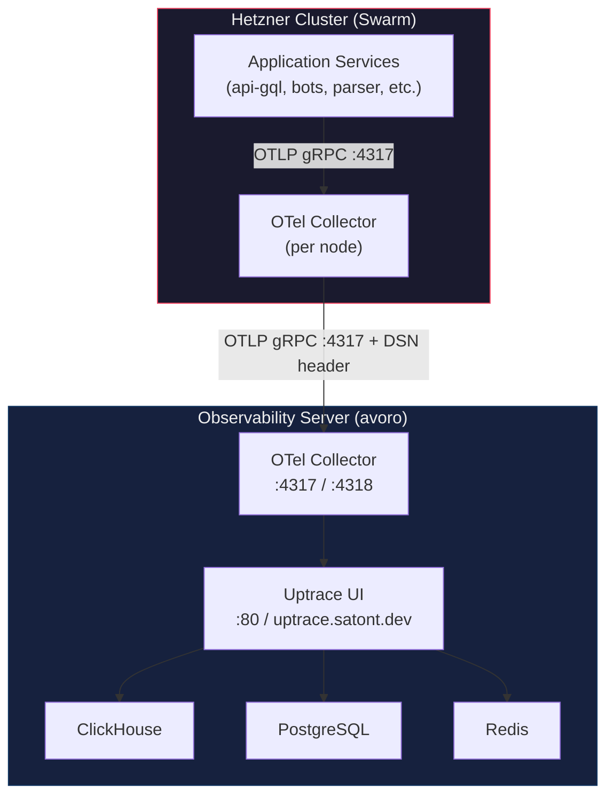

# Observability Stack

Observability based on **Uptrace** (self-hosted). Provides distributed tracing, metrics, and log aggregation with a single Uptrace UI.

## Architecture



## Components

### Observability Server (avoro) — `/root/satont/infra/uptrace`

| Component | Image | Purpose |
|-----------|-------|---------|
| Uptrace | `uptrace/uptrace:2.1.0-beta.5` | UI + API + OTLP ingestion |
| ClickHouse | `clickhouse/clickhouse-server:26.3` | Telemetry storage |
| PostgreSQL | `postgres:17-alpine` | Metadata storage |
| Redis | `redis:7-alpine` | Cache |
| OTel Collector | `otel/opentelemetry-collector-contrib:0.123.0` | OTLP receiver |

### Hetzner Cluster

| Component | Image | Purpose |
|-----------|-------|---------|
| OTel Collector | `otel/opentelemetry-collector-contrib:0.121.0` | Collects traces, container metrics (docker_stats), container logs (filelog) |

## DSN

```
http://project1_secret@uptrace.satont.dev?grpc=4317
```

## Configuration

### OTel Collector (Hetzner)

Edit `configs/otel/otel-collector.yaml`:

```yaml
exporters:
  otlp/uptrace:
    endpoint: UPTRACE_HOST:4317
    tls:
      insecure: true
    headers:
      uptrace-dsn: "http://project1_secret@UPTRACE_HOST:80?grpc=4317"
```

### Application Environment Variables (Doppler)

```env
OTEL_ENDPOINT=UPTRACE_HOST:4317
OTEL_INSECURE=true
OTEL_TRACING_ENABLED=true
```

## Access

- **URL**: `https://uptrace.satont.dev`
- **Login**: `admin@uptrace.local` / `admin`
- Change password on first login

## Links

- [Uptrace Docs](https://uptrace.dev/get/hosted/config)
- [Uptrace Docker Example](https://github.com/uptrace/uptrace/tree/master/example/docker)
- [OTel Collector Docs](https://opentelemetry.io/docs/collector/)
