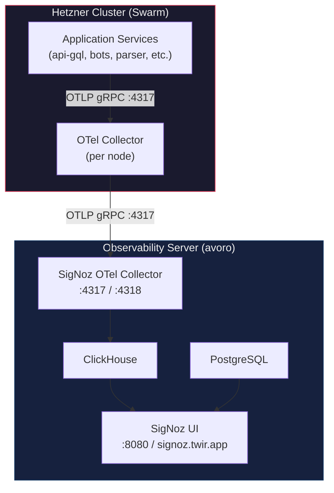

# Observability Stack

Full observability stack based on **SigNoz** (self-hosted). Provides distributed tracing, container metrics, and log aggregation with a single SigNoz UI.

## Architecture



## Data Flow

| Signal | Hetzner Collector | Destination |
|--------|------------------|-------------|
| **Traces** | OTLP receiver → batch | SigNoz (OTLP :4317) |
| **Metrics** | docker_stats receiver → batch | SigNoz (OTLP :4317) |
| **Logs** | filelog receiver (Docker JSON logs) → batch | SigNoz (OTLP :4317) |
| **App metrics** | OTLP receiver from apps → batch | SigNoz (OTLP :4317) |

## Components

### Observability Server (avoro)

| Component | Image | Port | Purpose |
|-----------|-------|------|---------|
| SigNoz | `signoz/signoz:v0.131.1` | 8080 | UI + API |
| SigNoz OTel Collector | `signoz/signoz-otel-collector:latest` | 4317, 4318 | Ingests OTLP data |
| ClickHouse | `clickhouse/clickhouse-server:25.12.5` | internal | Telemetry storage |
| ClickHouse Keeper | `clickhouse/clickhouse-keeper:25.12.5` | internal | Coordination |
| PostgreSQL | `postgres:16` | internal | SigNoz metastore |

### Collection Layer (Hetzner Cluster)

| Component | Image | Purpose |
|-----------|-------|---------|
| OTel Collector | `otel/opentelemetry-collector-contrib:0.121.0` | Collects traces, metrics (docker_stats), and logs (filelog) |

## Deployment

### 1. Observability Server (avoro)

```bash
ssh avoro
cd /root/satont/infra/twir

# Copy the signoz configs
cp -r configs/signoz /opt/signoz
cp docker-compose.signoz.yml /opt/signoz/

cd /opt/signoz
docker compose -f docker-compose.signoz.yml up -d
```

SigNoz UI: `https://signoz.twir.app` (via Caddy) or `http://AVORO_IP:8080`
Default login: `admin` / `signoz`

### 2. Hetzner Cluster

Edit `configs/otel/otel-collector.yaml` — replace `OBSERVABILITY_SERVER_IP` with the actual avoro IP.

Deploy:

```bash
docker stack deploy -c docker-compose.stack.yml --resolve-image changed --with-registry-auth twir
```

## Configuration

### Application Environment Variables (Doppler)

```env
OTEL_ENDPOINT=AVORO_IP:4317
OTEL_INSECURE=true
OTEL_TRACING_ENABLED=true
```

### OTel Collector Config (`configs/otel/otel-collector.yaml`)

```yaml
receivers:
  otlp:
    protocols:
      grpc:
        endpoint: 0.0.0.0:4317
      http:
        endpoint: 0.0.0.0:4318
  docker_stats:
    endpoint: unix:///var/run/docker.sock
    collection_interval: 15s
  filelog:
    include:
      - /var/lib/docker/containers/*/*.log

processors:
  batch:
    timeout: 10s

exporters:
  otlp/signoz:
    endpoint: OBSERVABILITY_SERVER_IP:4317
    tls:
      insecure: true

service:
  pipelines:
    traces:
      receivers: [otlp]
      processors: [batch]
      exporters: [otlp/signoz]
    metrics:
      receivers: [otlp, docker_stats]
      processors: [batch]
      exporters: [otlp/signoz]
    logs:
      receivers: [otlp, filelog]
      processors: [batch]
      exporters: [otlp/signoz]
```

## SigNoz Access

- **URL**: `https://signoz.twir.app`
- **Default login**: `admin` / `signoz`
- Change password on first login

## Resource Requirements

### Observability Server (avoro)

| Component | RAM | Disk |
|-----------|-----|------|
| SigNoz | ~512MB | ~1GB |
| ClickHouse | ~1GB | configurable retention |
| ClickHouse Keeper | ~128MB | ~500MB |
| PostgreSQL | ~256MB | ~500MB |
| OTel Collector | ~256MB | - |
| **Total** | **~2.1GB** | |

## Troubleshooting

### Data not appearing

1. Check SigNoz OTel Collector logs: `docker logs signoz-ingester`
2. Verify network connectivity: `telnet AVORO_IP 4317`
3. Check ClickHouse health: `docker exec signoz-clickhouse clickhouse-client -q "SELECT 1"`
4. Check SigNoz health: `curl http://AVORO_IP:8080/api/v1/health`

### Hetzner OTel Collector issues

1. Check logs: `docker service logs twir_otel-collector`
2. Verify config: the config is mounted from `configs/otel/otel-collector.yaml`

## Links

- [SigNoz Docs](https://signoz.io/docs/)
- [SigNoz Docker Install](https://signoz.io/docs/install/docker/)
- [OTel Collector Docs](https://opentelemetry.io/docs/collector/)
